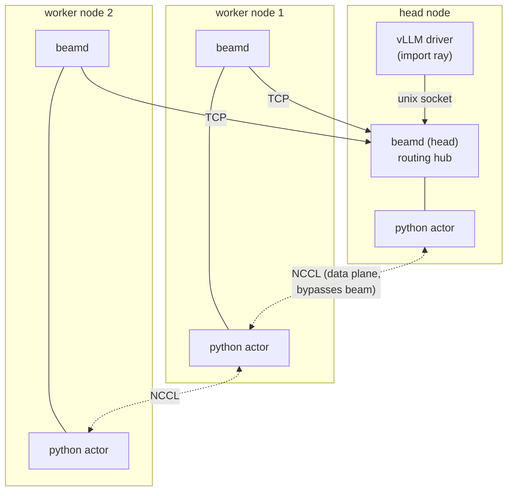
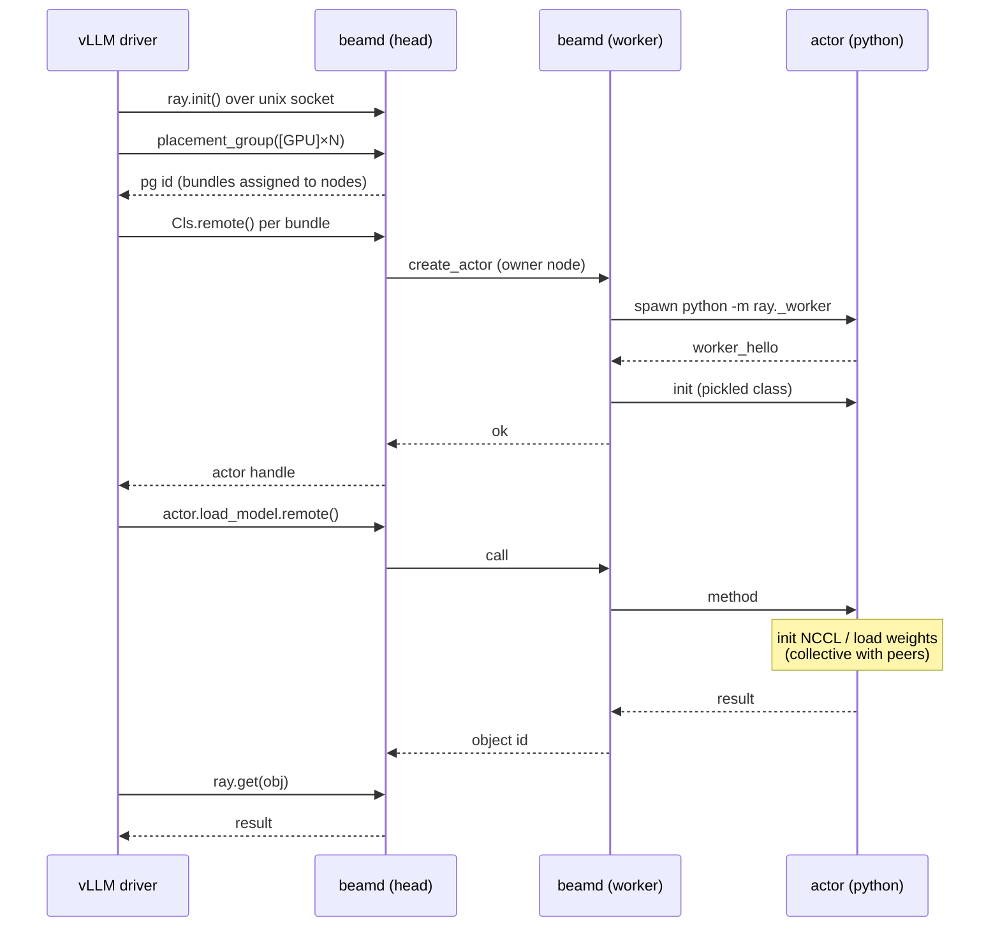

# Architecture

beam is the control plane vLLM expects from Ray, and nothing else. This document
describes the components, how they connect, and what happens end to end when
vLLM starts a multi-node tensor-parallel server.

## The one idea

vLLM uses Ray only to:

1. start one worker process per GPU, on the right node, with the right
   `CUDA_VISIBLE_DEVICES`,
2. broadcast method calls (`init_device`, `load_model`, `execute_model`, …) to
   those workers,
3. collect the small return values.

The actual tensor-parallel traffic (activations, all-reduce) goes over
**NCCL / torch.distributed**, which vLLM sets up itself. That traffic never
touches Ray, so it never touches beam. beam therefore needs only: cluster
membership, GPU accounting, placement groups, and an actor-call hub. Everything
else Ray does (object store for big data, scheduling, autoscaling, the
dashboard) is out of scope.

## Components

The vLLM driver connects to its local `beamd` over a unix socket; worker daemons
dial the head over TCP and the head pushes work down those connections. Tensor
traffic (dashed) goes node-to-node over NCCL and never touches beam.

Three kinds of process, all Python:

- **The shim** (`import ray`): runs *inside* vLLM's own process. vLLM imports it
  in-process, so it must be Python and must live in the same interpreter. It
  translates ray API calls into requests to the local daemon over a unix socket.
  Files: `ray/__init__.py`, `ray/util/*`, `ray/_client.py`, `ray/_proto.py`.

- **The daemon** (`ray._daemon`, started by `ray start`): one per node, asyncio.
  The head daemon is the routing hub and the authority on membership and
  placement. Worker daemons dial the head once and keep that connection; the head
  pushes actor create/call/kill requests down it. Files: `ray/_daemon.py`,
  `ray/_cli.py`.

- **The actor worker** (`ray._worker`): one subprocess per actor, spawned by a
  daemon with the actor's `CUDA_VISIBLE_DEVICES`. It unpickles the class vLLM
  sent, instantiates it, and serves method calls one at a time (Ray actors are
  single-threaded). File: `ray/_worker.py`.

## Topology: star with the head as hub

- Worker daemons connect only to the head. They never talk to each other through
  beam (NCCL does that directly, node to node).
- The vLLM driver connects to its **local** daemon (the head daemon, since the
  driver runs on the head node).
- Every cross-node control message is routed through the head. The volume is
  tiny (a handful of small RPCs per inference step), so a star hub is fine.

Object ids encode their owner node (`<node>-o<seq>`), so any daemon can route a
fetch to the owner without a lookup.

## Lifecycle: a vLLM multi-node startup, step by step

1. **Cluster up.** `ray start --head` on node A starts the head daemon (TCP
   `:6379` + a local unix socket). `ray start --address A:6379` on node B starts
   a worker daemon that dials the head and registers (`hello`: node id, ip, GPU
   count). The head now knows both nodes and their GPUs.

2. **vLLM starts.** `vllm serve --distributed-executor-backend ray` runs in the
   head container. vLLM does `import ray` (the shim) and `ray.init()`, which
   opens a unix-socket connection to the head daemon.

3. **Placement group.** vLLM calls `ray.util.placement_group([{ "GPU":1 }] * N)`
   (one bundle per worker). The shim sends `create_pg`; the head assigns each
   bundle a free GPU on some node and returns a pg id. vLLM reads back the
   bundle→node map with `placement_group_table`.

4. **Workers.** For each bundle, vLLM calls
   `ray.remote(num_gpus=1, scheduling_strategy=PlacementGroupSchedulingStrategy(
   pg, bundle_index=i))(WorkerClass).remote(...)`. The shim sends `create_actor`
   with the pickled class + the pg/bundle. The head picks the bundle's node and
   either hosts the actor locally or pushes `create_actor` to that node's worker
   daemon, which spawns `python -m ray._worker` with the bundle's GPU in
   `CUDA_VISIBLE_DEVICES`. The worker attaches (`worker_hello`) and is
   initialized (`init` with the pickled class).

5. **Rank assignment.** vLLM calls `get_node_and_gpu_ids` on every worker
   (`call` → method on the actor), sorts by (node, gpu) to assign TP ranks, and
   sets each worker's distributed-init env via more method calls.

6. **Model load + NCCL.** vLLM broadcasts `init_device` / `load_model` /
   `determine_num_available_blocks` as actor method calls. Inside those, the
   workers run `torch.distributed.init_process_group(backend="nccl")` and build
   the NCCL communicator over RoCE — directly between nodes, not through beam.

7. **Serving.** vLLM calls `handle.run()` on each worker; that method never
   returns (it is the worker's execution loop, fed by vLLM's own shared-memory
   MessageQueue, not by ray). beam keeps the call's `ObjectRef` permanently
   not-ready. A monitor thread polls `ray.wait(run_refs, timeout=…)` to detect a
   worker dying; beam's `stat` answers ready/not-ready without blocking.

At this point the OpenAI server is up. Inference requests flow through vLLM's own
machinery; beam is idle except for the occasional liveness `stat`.

## Concurrency model

- **Daemon:** single-threaded asyncio. Each connection is served by a coroutine;
  each incoming request is handled in its own task, so a slow routed call never
  blocks the read loop. A `Peer` is a bidirectional RPC mux: it matches responses
  to requests by `reqid` and lets the head both answer the shim and initiate
  requests to workers over one socket.
- **Per-actor serialization:** each actor has an `asyncio.Lock`; calls to the
  same actor run one at a time (Ray semantics), calls to different actors run
  concurrently. The long-lived `run()` call holds its actor's lock for the
  server's lifetime, which is correct — that actor is busy.
- **Shim client:** one unix socket guarded by a threading lock; the driver's ray
  calls serialize through it. This is fine because vLLM's hot path uses its own
  MessageQueue, so ray calls after startup are infrequent (mostly liveness).

## Cleanup

When the driver disconnects (e.g. `ray.shutdown` or process exit), the head frees
the placement groups and kills the actors that connection created, returning
their GPUs to the pool. This is what prevents a leaked placement group from one
run starving the next.

## Why Python, not Go

An earlier version had a Go daemon. The shim is forced to be Python (in-process
`import ray`) and the actor workers are Python (they run vLLM's torch code), so
Go was the only non-Python piece: it added a second language, arm64
cross-compilation, a static binary to ship, and a wire protocol written twice —
all for a control plane that does a handful of tiny RPCs per step, where Go's
speed buys nothing. Collapsing to one language removed the build step entirely
and made runtime injection a single bind mount.
