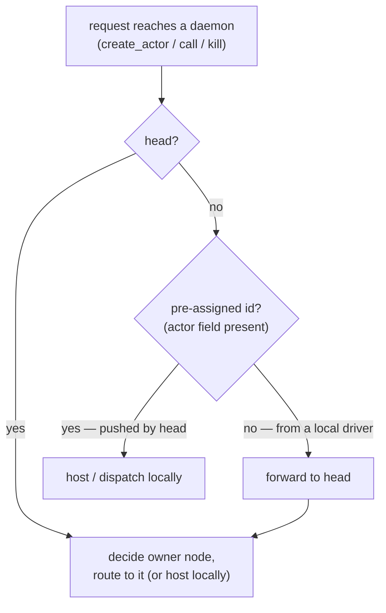

# Wire protocol

One framing for every link: the shim↔daemon unix socket, the head↔worker-daemon
TCP connection, and the daemon↔actor-worker unix socket.

## Frame

```
┌────────────────┬──────────────────────┬─────────────────────────┐
│ 4 bytes        │ N bytes              │ plen bytes              │
│ uint32 BE = N  │ JSON header          │ raw payload (optional)  │
└────────────────┴──────────────────────┴─────────────────────────┘
```

- The 4-byte big-endian length covers only the JSON header.
- The header's `plen` field gives the length of the raw payload that follows.
  The payload is opaque bytes: cloudpickled Python objects (class+args, method
  args, return values). The daemon never unpickles it; only the shim and the
  actor worker do.

## Header fields

| field    | type   | meaning                                              |
|----------|--------|------------------------------------------------------|
| `t`      | string | message type (e.g. `create_actor`, `call`, `get`)    |
| `reqid`  | int    | request id, echoed on the response                   |
| `resp`   | bool   | true on a response frame                             |
| `err`    | string | error text; the caller raises if set                 |
| `plen`   | int    | payload byte length following the header             |
| …        |        | type-specific fields below                           |

A request carries `t` + `reqid` + type-specific fields. Its response echoes
`reqid` with `resp=true` and either result fields or `err`. A single connection
is a bidirectional mux: both ends may issue requests; responses are matched by
`reqid`.

## Message types

Payload column: ✓ means the frame carries a cloudpickled payload.

| `t`             | direction              | request fields        | reply fields           | payload |
|-----------------|------------------------|-----------------------|------------------------|---------|
| `hello`         | worker daemon → head   | `node` `ip` `ngpu`    | —                      |         |
| `worker_hello`  | actor worker → daemon  | `actor`               | —                      |         |
| `status`        | client/worker → head   | —                     | `nodes[]`              |         |
| `create_pg`     | client → head          | `specs[]`             | `pg`                   |         |
| `remove_pg`     | client → head          | `pg`                  | —                      |         |
| `pg_table`      | client → head          | `pg` (optional)       | `data`                 |         |
| `resources`     | client → head          | —                     | `data`                 |         |
| `create_actor`  | client → head → owner  | `ngpu` `pg` `bundle`  | `actor` `gpus` `node`  | ✓ (in)  |
| `init`          | daemon → actor worker  | —                     | —                      | ✓ (in)  |
| `call`          | client → head → owner  | `actor` `method`      | `obj`                  | ✓ (in)  |
| `method`        | daemon → actor worker  | `method`              | —                      | ✓ both  |
| `kill`          | client → head → owner  | `actor`               | —                      |         |
| `put`           | client → owner         | —                     | `obj`                  | ✓ (in)  |
| `get`           | client → head → owner  | `obj`                 | —                      | ✓ (out) |
| `stat`          | client → head → owner  | `obj`                 | `ready` (bool)         |         |

Notes:

- **`specs`** is the placement-group bundle list, e.g. `[{"GPU":1},{"GPU":1}]`.
- **`nodes[]`** entries: `node`, `ip`, `ngpu`, `used`, `alive`, `head`.
- **`data`** (pg_table) is `{ "bundles": [ {"node","spec"}, … ] }` for one group,
  or `{ "pgs": { id: [...] } }` for all. The shim turns this into ray's
  `{"bundles_to_node_id": {idx:node}, "bundles": {idx:spec}}` with integer keys.
- **`data`** (resources) is `{ node_id: {"GPU": free, "CPU": 1.0} }`.
- **`gpus`** is the physical GPU id list assigned to the actor; the worker also
  receives it as `BEAM_GPU_IDS` and reports it from `ray.get_gpu_ids()`.
- **`stat`** never sets `err` for a not-ready object; it returns `ready: false`.
  This is deliberate: `ray.wait` polls `stat` and must not raise on not-ready.

## Routing



This is what lets the driver run on any node: a request from a local driver on a
worker has no head-assigned id, so the worker forwards it to the head for
placement; a request the head pushed down already carries the id and is handled
locally.

The head is the hub. For a request about a remote actor or object:

- `create_actor`: head picks the bundle's node, pushes `create_actor` to that
  worker daemon (or hosts locally).
- `call`: head forwards to the owner daemon, which allocates the `obj` id (with
  its own node prefix), dispatches the method asynchronously, and returns the id
  immediately.
- `get` / `stat`: the `obj` id encodes the owner node; the head forwards to that
  daemon. A worker daemon that somehow needs a non-local object forwards to the
  head.

Object ids look like `n1a2b3c4-o57`; the owner is everything before `-o`.
